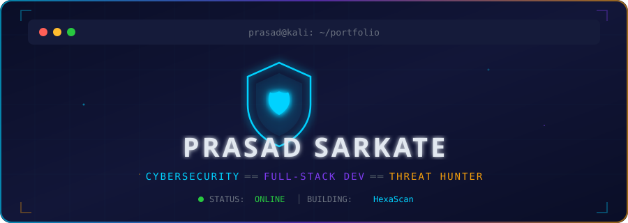
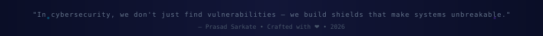

<!-- ╔══════════════════════════════════════════════════════════════════════╗ -->
<!-- ║    PRASAD SARKATE — GitHub Profile                                  ║ -->
<!-- ║    Theme: Cyber-Noir (Deep Navy + Cyan + Purple + Amber)            ║ -->
<!-- ║    Custom SVG assets in /assets/                                     ║ -->
<!-- ╚══════════════════════════════════════════════════════════════════════╝ -->

<!-- ═══════════════ ANIMATED HEADER (Custom SVG) ═══════════════ -->

<div align="center">
<a href="https://github.com/Prasadsarkate">

</a>
</div>

<!-- ═══════════════ TYPING ANIMATION ═══════════════ -->

<div align="center">
<br/>
<a href="https://github.com/Prasadsarkate">

</a>

<br/>

<!-- PROFILE METRICS -->

&nbsp;
<a href="https://github.com/Prasadsarkate?tab=followers">

</a>
&nbsp;
<a href="https://github.com/Prasadsarkate?tab=repositories">

</a>

</div>

<!-- ═══════════════ DIVIDER ═══════════════ -->


<!-- ═══════════════ STATUS CARDS (Custom SVG) ═══════════════ -->

<div align="center">

</div>

<!-- ═══════════════ DIVIDER ═══════════════ -->


<!-- ═══════════════ ABOUT ME — TERMINAL STYLE ═══════════════ -->

<table align="center">
<tr>
<td width="55%">

```js
// prasad-sarkate.config.js

const developer = {
    name: "Prasad Sarkate",
    title: "Cybersecurity Researcher & Full-Stack Dev",
    location: "India 🇮🇳",
    
    education: "Computer Science",
    
    fields: [
        "🛡️ Cybersecurity & Ethical Hacking",
        "☕ Java Full-Stack Development",
        "⚛️ React & Node.js Applications",
        "🔍 Vulnerability Assessment & Pentesting"
    ],
    
    currentFocus: "Building HexaScan 🔭",
    
    askMeAbout: [
        "CyberSecurity", "Web App Security",
        "Java", "React", "Collaboration"
    ],
    
    funFact: "I debug my life by talking to AI 🤖"
};

module.exports = developer;
```

</td>
<td width="45%">

<div align="center">


<br/><br/>


</div>

</td>
</tr>
</table>

<!-- ═══════════════ DIVIDER ═══════════════ -->


<!-- ═══════════════ SKILL MATRIX (Custom SVG) ═══════════════ -->

<div align="center">

</div>

<!-- ═══════════════ DIVIDER ═══════════════ -->


<!-- ═══════════════ TECH BADGES ═══════════════ -->

<div align="center">

### `🧰 TECH ARSENAL`

<br/>

<!-- Languages -->


<br/><br/>

<!-- Frameworks & Tools -->


<br/><br/>

<!-- Security -->


<br/><br/>

<!-- DevOps & Tools -->


</div>

<!-- ═══════════════ DIVIDER ═══════════════ -->


<!-- ═══════════════ FEATURED PROJECTS ═══════════════ -->

<div align="center">

### `📌 FEATURED PROJECTS`

<br/>

</div>

<table align="center">
<tr>
<td width="50%" valign="top">

<h3 align="center">
<a href="https://github.com/Prasadsarkate/authshield">🛡️ AuthShield</a>
</h3>

<div align="center">

<a href="https://github.com/Prasadsarkate/authshield">

</a>

<br/>

Enterprise MFA Authentication System with 4 MFA methods, admin dashboard, SSO simulation & audit logging

<br/><br/>


</div>

</td>
<td width="50%" valign="top">

<h3 align="center">
<a href="https://github.com/Prasadsarkate">🔍 HexaScan</a>
</h3>

<div align="center">

<a href="https://github.com/Prasadsarkate">

</a>

<br/>

Advanced cybersecurity scanning toolkit for vulnerability assessment, threat detection & network analysis

<br/><br/>


</div>

</td>
</tr>
</table>

<!-- ═══════════════ DIVIDER ═══════════════ -->


<!-- ═══════════════ GITHUB STATS ═══════════════ -->

<div align="center">

### `📊 GITHUB ANALYTICS`

<br/>

<!-- Streak Stats -->
<a href="https://github.com/Prasadsarkate">

</a>

<br/><br/>

<!-- Top Languages + Stats side by side -->
<a href="https://github.com/Prasadsarkate">

</a>
&nbsp;&nbsp;
<a href="https://github.com/Prasadsarkate">

</a>

<br/><br/>

<!-- Activity Graph -->


</div>

<!-- ═══════════════ DIVIDER ═══════════════ -->


<!-- ═══════════════ TROPHIES ═══════════════ -->

<div align="center">

### `🏆 ACHIEVEMENTS`

<br/>


</div>

<!-- ═══════════════ DIVIDER ═══════════════ -->


<!-- ═══════════════ SNAKE ANIMATION ═══════════════ -->

<div align="center">

### `🐍 WATCH THE SNAKE EAT MY CONTRIBUTIONS`

<br/>

<picture>
  <source media="(prefers-color-scheme: dark)" srcset="https://raw.githubusercontent.com/Prasadsarkate/PrasadSarkate/output/github-snake-dark.svg" />
  <source media="(prefers-color-scheme: light)" srcset="https://raw.githubusercontent.com/Prasadsarkate/PrasadSarkate/output/github-snake.svg" />
  
</picture>

</div>

<!-- ═══════════════ DIVIDER ═══════════════ -->


<!-- ═══════════════ CONNECT ═══════════════ -->

<div align="center">

### `📡 CONNECT WITH ME`

<br/>

<a href="https://www.linkedin.com/in/prasadsarkate/" target="_blank">

</a>
&nbsp;
<a href="https://instagram.com/prasad_sarkate" target="_blank">

</a>
&nbsp;
<a href="https://x.com/@Prasad_Sarkate" target="_blank">

</a>
&nbsp;
<a href="https://discord.gg/MQqaY6mA" target="_blank">

</a>
&nbsp;
<a href="https://youtube.com/@hexacoresecurity" target="_blank">

</a>
&nbsp;
<a href="https://www.reddit.com/user/prasad_sarkate/" target="_blank">

</a>
&nbsp;
<a href="mailto:prasadsarkate9699@gmail.com">

</a>

<br/><br/>

<!-- SUPPORT -->

<a href="https://buymeacoffee.com/prasadsarkh">

</a>
&nbsp;
<a href="https://paypal.me/PrasadSarkate">

</a>
&nbsp;
<a href="https://ko-fi.com/prasadsarkate">

</a>

</div>

<br/>

<!-- ═══════════════ QUOTE ═══════════════ -->

<div align="center">

</div>

<br/>

<!-- ═══════════════ FOOTER (Custom SVG) ═══════════════ -->

<div align="center">

</div>
