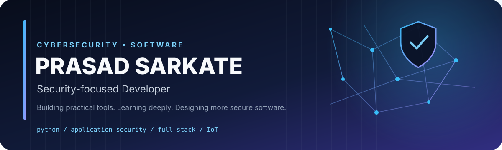
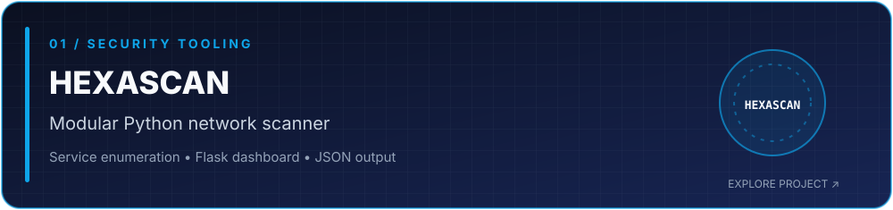
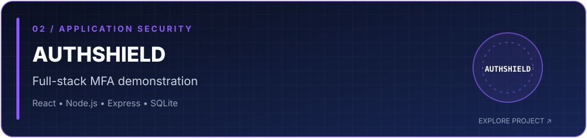
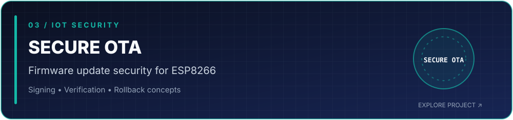

 

  

 

*I build practical software projects with a security-first mindset.*

---

## `whoami` — Hey, I'm Prasad 👋

I'm a developer interested in **cybersecurity, application security, Python tooling, and full-stack engineering**. I enjoy turning concepts into working projects, documenting what I learn, and improving software through testing and iteration.

- 🔭 **Building:** security-focused tools and application prototypes
- 🛡️ **Interested in:** application security, network security, authentication, and IoT security
- 🧰 **Working with:** Python, JavaScript, React, Node.js, Express, SQLite, and Git
- 🌱 **Learning:** secure design, testing, and practical security engineering
- 🤝 **Open to:** learning opportunities, thoughtful collaboration, and useful open-source contributions

> I aim to make my projects reproducible and transparent: clear setup steps, honest limitations, and evidence for security claims.

---

## ✦ Featured projects

### More than a project name

| Project | What it explores | Repository |
|---|---|---|
| **HexaScan** | Modular Python network scanning and service enumeration | [Explore →](https://github.com/prasadsarkate/HexaScan) |
| **AuthShield** | Full-stack multi-factor authentication demonstration | [Explore →](https://github.com/prasadsarkate/AuthShield) |
| **Secure OTA for IoT** | Firmware-update security concepts for ESP8266 devices | [Explore →](https://github.com/prasadsarkate/Secure-OTA-Firmware-Update-IoT) |

*Project descriptions reflect their documented scope. Please check each repository's README for current implementation details, setup instructions, and limitations.*

---

## ⚙️ Tech I work with

  

---

## 📊 GitHub activity

 

 

Stats and third-party widgets may occasionally be unavailable or rate-limited. Language charts are estimates and don't measure skill or code quality.

---

## 🧭 What you'll find here

- **Security experiments** — learning-focused tools and lab projects
- **Application development** — frontend, backend, and database practice
- **Project documentation** — setup guides, design notes, and lessons learned
- **Continuous improvement** — refactoring, tests, and incremental progress

## 📬 Let's connect

  

**Thanks for visiting — explore a repository, open an issue, or say hello.** ✨

