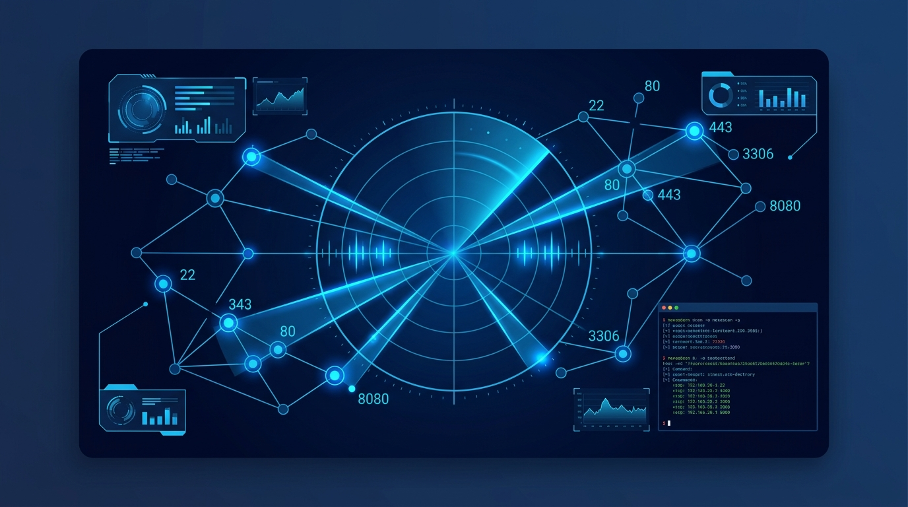
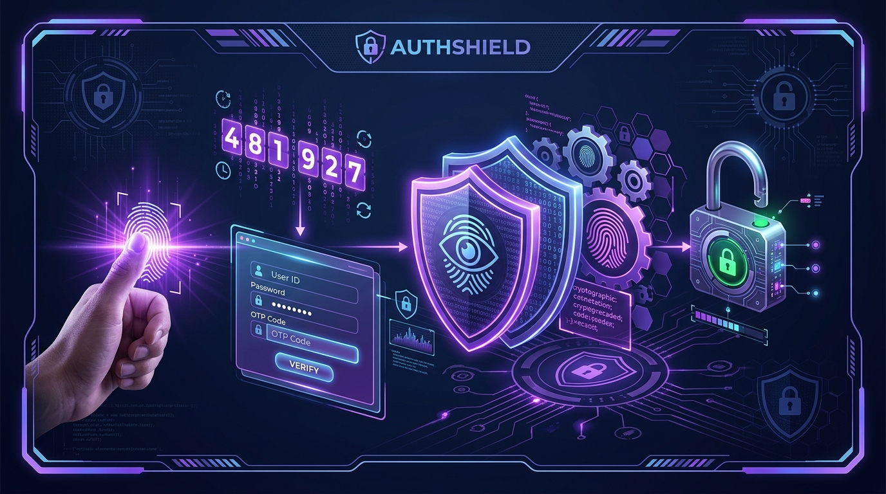

<a id="top"></a>

<div align="center">

<!-- ═══════════════════════════════════════════════════════════════════════════ -->
<!-- SECTION 1 — CINEMATIC HERO BANNER                                         -->
<!-- ═══════════════════════════════════════════════════════════════════════════ -->

<picture>
  <source media="(prefers-color-scheme: dark)" srcset="./assets/hero-banner-animated.svg">
  <source media="(prefers-color-scheme: light)" srcset="./assets/hero-banner-animated.svg">
  
</picture>

<br>

<!-- ═══════════════════════════════════════════════════════════════════════════ -->
<!-- SECTION 2 — NAVIGATION BAR                                                -->
<!-- ═══════════════════════════════════════════════════════════════════════════ -->

<a href="#-hey-im-prasad"></a>&nbsp;
<a href="#-flagship-projects"></a>&nbsp;
<a href="#%EF%B8%8F-tech-arsenal"></a>&nbsp;
<a href="#-security-lab"></a>&nbsp;
<a href="#-github-analytics"></a>&nbsp;
<a href="#-lets-connect"></a>

<br><br>

<!-- ═══════════════════════════════════════════════════════════════════════════ -->
<!-- SECTION 3 — ANIMATED TYPING INTRODUCTION                                  -->
<!-- ═══════════════════════════════════════════════════════════════════════════ -->


</div>

<!-- ═══════════════════════════════════════════════════════════════════════════ -->
<!-- SECTION 4 — ABOUT ME (TERMINAL STYLE)                                     -->
<!-- ═══════════════════════════════════════════════════════════════════════════ -->


<table>
<tr>
<td width="300" align="center" valign="top">

<br>


<br><br>

<a href="https://github.com/prasadsarkate"></a>

<a href="https://www.linkedin.com/in/prasadsarkate"></a>

<a href="https://hexacoreclasses.in/"></a>

<br><br>

</td>
<td valign="top">

## 💀 Hey, I'm Prasad

```js
// whoami — prasad_sarkate.config
const developer = {
    name: "Prasad Sarkate",
    role: "Security-Focused Developer",
    location: "India 🇮🇳",
    education: "Computer Science & Engineering",
    website: "hexacoreclasses.in",
    
    focus: [
        "Application Security",
        "Network Security",
        "Full Stack Development",
        "IoT Security"
    ],
    
    currentlyBuilding: "Security tools & auth frameworks",
    philosophy: "Make every system a little more secure"
};
```

<kbd>🐍 Python</kbd>&nbsp;<kbd>🛡️ AppSec</kbd>&nbsp;<kbd>🌐 Full Stack</kbd>&nbsp;<kbd>🔌 IoT Security</kbd>&nbsp;<kbd>🔍 Network Security</kbd>

> *"I build practical software with a security-first mindset — clear setup, honest limitations, and evidence for every claim."*

</td>
</tr>
</table>

<!-- ═══════════════════════════════════════════════════════════════════════════ -->
<!-- SECTION 5 — DIVIDER                                                        -->
<!-- ═══════════════════════════════════════════════════════════════════════════ -->


<!-- ═══════════════════════════════════════════════════════════════════════════ -->
<!-- SECTION 6 — FEATURED PROJECTS (BENTO GRID)                                -->
<!-- ═══════════════════════════════════════════════════════════════════════════ -->

<div align="center">

## 🏗️ Flagship Projects

</div>

<table width="100%" border="0" cellspacing="0" cellpadding="8">
<tr>
<td width="50%" valign="top">

<a href="https://github.com/prasadsarkate/HexaScan">
  
</a>

### 🔹 HexaScan

**Modular Python network scanner** with service enumeration, Flask dashboard, and JSON output.

<kbd>Python</kbd>&nbsp;<kbd>Flask</kbd>&nbsp;<kbd>Nmap</kbd>&nbsp;<kbd>Security Tooling</kbd>

<a href="https://github.com/prasadsarkate/HexaScan"></a>

</td>
<td width="50%" valign="top">

<a href="https://github.com/prasadsarkate/AuthShield">
  
</a>

### 🔹 AuthShield

**Full-stack multi-factor authentication** demonstration with React frontend and Express backend.

<kbd>React</kbd>&nbsp;<kbd>Node.js</kbd>&nbsp;<kbd>Express</kbd>&nbsp;<kbd>SQLite</kbd>

<a href="https://github.com/prasadsarkate/AuthShield"></a>

</td>
</tr>
<tr>
<td width="50%" valign="top">

<a href="https://github.com/prasadsarkate/Secure-OTA-Firmware-Update-IoT">
  
</a>

### 🔹 Secure OTA for IoT

**Firmware update security** concepts for ESP8266 — signing, verification, and rollback mechanisms.

<kbd>IoT</kbd>&nbsp;<kbd>ESP8266</kbd>&nbsp;<kbd>Firmware Security</kbd>&nbsp;<kbd>C++</kbd>

<a href="https://github.com/prasadsarkate/Secure-OTA-Firmware-Update-IoT"></a>

</td>
<td width="50%" valign="top">

<a href="https://hexacoreclasses.in/">
  
</a>

### 🔹 HexaCore Classes

**Education platform** for cybersecurity and programming — sharing knowledge and building community.

<kbd>Web Development</kbd>&nbsp;<kbd>Education</kbd>&nbsp;<kbd>Cybersecurity</kbd>

<a href="https://hexacoreclasses.in/"></a>

</td>
</tr>
</table>

<!-- ═══════════════════════════════════════════════════════════════════════════ -->
<!-- SECTION 7 — PROJECT DETAILS TABLE                                          -->
<!-- ═══════════════════════════════════════════════════════════════════════════ -->

<details>
<summary><b>📋 Quick Project Reference Table</b></summary>
<br>

| Project | What it explores | Tech Stack | Repository |
|---|---|---|---|
| **HexaScan** | Modular network scanning & service enumeration | Python, Flask, Nmap | [Explore →](https://github.com/prasadsarkate/HexaScan) |
| **AuthShield** | Full-stack multi-factor authentication | React, Node.js, Express, SQLite | [Explore →](https://github.com/prasadsarkate/AuthShield) |
| **Secure OTA** | Firmware update security for ESP8266 devices | C++, IoT, ESP8266 | [Explore →](https://github.com/prasadsarkate/Secure-OTA-Firmware-Update-IoT) |

*Project descriptions reflect their documented scope. Check each repository's README for details.*

</details>

<!-- ═══════════════════════════════════════════════════════════════════════════ -->
<!-- SECTION 8 — DIVIDER                                                        -->
<!-- ═══════════════════════════════════════════════════════════════════════════ -->


<!-- ═══════════════════════════════════════════════════════════════════════════ -->
<!-- SECTION 9 — TECH STACK (CATEGORIZED)                                       -->
<!-- ═══════════════════════════════════════════════════════════════════════════ -->

<div align="center">

## ⚙️ Tech Arsenal



</div>

<br>

<table width="100%" border="0" cellspacing="0" cellpadding="8">
<tr>
<td width="50%" align="center" valign="top">


<br><br>


</td>
<td width="50%" align="center" valign="top">


<br><br>


</td>
</tr>
<tr>
<td width="50%" align="center" valign="top">


<br><br>


</td>
<td width="50%" align="center" valign="top">


<br><br>


</td>
</tr>
</table>

<div align="center">

<br>


<br><br>

<a href="#-security-lab"></a>
<a href="#-security-lab"></a>
<a href="#-security-lab"></a>
<a href="#-security-lab"></a>
<a href="#-security-lab"></a>

</div>

<!-- ═══════════════════════════════════════════════════════════════════════════ -->
<!-- SECTION 10 — DIVIDER                                                       -->
<!-- ═══════════════════════════════════════════════════════════════════════════ -->


<!-- ═══════════════════════════════════════════════════════════════════════════ -->
<!-- SECTION 11 — SECURITY LAB (COLLAPSIBLE)                                    -->
<!-- ═══════════════════════════════════════════════════════════════════════════ -->

<div align="center">

## 🔬 Security Lab

</div>

<details>
<summary><b>🔍 Security Testing Methodology</b></summary>
<br>

```
┌─────────────────────────────────────────────────────────────┐
│                  SECURITY TESTING PIPELINE                   │
├─────────────┬─────────────┬──────────────┬─────────────────┤
│  RECON      │  SCANNING   │  ANALYSIS    │  REPORTING      │
│             │             │              │                 │
│ • Target    │ • Port Scan │ • Vuln       │ • Documentation │
│   Profiling │ • Service   │   Assessment │ • Remediation   │
│ • OSINT     │   Enum      │ • Code       │   Steps         │
│ • Scope     │ • Version   │   Review     │ • Risk Rating   │
│   Mapping   │   Detection │ • Auth Tests │ • Retesting     │
└─────────────┴─────────────┴──────────────┴─────────────────┘
```

- **Approach:** Systematic, methodical, and reproducible
- **Focus:** Application-layer vulnerabilities, authentication flaws, network misconfigurations
- **Tools:** Python-based custom tooling, Nmap, Wireshark, Burp Suite fundamentals

</details>

<details>
<summary><b>🧰 Development Environment & Tools</b></summary>
<br>

| Category | Tools |
|---|---|
| **OS** | Ubuntu Linux / Kali Linux |
| **Editor** | VS Code with security extensions |
| **Languages** | Python 3.x, JavaScript/TypeScript, Java, C++ |
| **Security** | Nmap, Wireshark, Burp Suite, OWASP ZAP |
| **Networking** | TCP/IP analysis, packet capture, service enumeration |
| **Version Control** | Git, GitHub |
| **Containers** | Docker for isolated testing environments |
| **IoT** | ESP8266, Arduino, firmware analysis |

</details>

<details>
<summary><b>📝 What You'll Find in My Repositories</b></summary>
<br>

- 🛡️ **Security experiments** — learning-focused tools, lab projects, and proof-of-concept implementations
- 🌐 **Application development** — frontend, backend, and database practice with security considerations
- 📖 **Documentation** — detailed setup guides, design decisions, architecture notes, and lessons learned
- 🔄 **Continuous improvement** — refactoring, testing, vulnerability fixes, and incremental progress
- 🔓 **Authentication & Authorization** — MFA implementations, session management, token-based auth
- 📡 **IoT Security** — firmware security, secure update mechanisms, device authentication

> Every project includes honest documentation about its scope, limitations, and areas for improvement.

</details>

<!-- ═══════════════════════════════════════════════════════════════════════════ -->
<!-- SECTION 12 — DIVIDER                                                       -->
<!-- ═══════════════════════════════════════════════════════════════════════════ -->


<!-- ═══════════════════════════════════════════════════════════════════════════ -->
<!-- SECTION 13 — GITHUB ANALYTICS                                              -->
<!-- ═══════════════════════════════════════════════════════════════════════════ -->

<div align="center">

## 📊 GitHub Analytics

<a href="https://github.com/prasadsarkate">
  
</a>
&nbsp;&nbsp;
<a href="https://github.com/prasadsarkate">
  
</a>

<br><br>


<br><br>


<br>

<sub>📌 Stats powered by third-party widgets — may occasionally be rate-limited. Language charts are estimates.</sub>

</div>

<!-- ═══════════════════════════════════════════════════════════════════════════ -->
<!-- SECTION 14 — CONTACT & FOOTER                                              -->
<!-- ═══════════════════════════════════════════════════════════════════════════ -->


<div align="center">

## 📬 Let's Connect

<br>

<a href="https://www.linkedin.com/in/prasadsarkate"></a>
&nbsp;
<a href="https://github.com/prasadsarkate"></a>
&nbsp;
<a href="https://hexacoreclasses.in/"></a>
&nbsp;
<a href="mailto:prasadsarkate@gmail.com"></a>

<br><br>

```
╔══════════════════════════════════════════════════════════════╗
║                                                              ║
║   👋  Thanks for visiting my profile!                        ║
║                                                              ║
║   ★  Star a repo if you find it useful                       ║
║   🍴  Fork and build upon my work                            ║
║   🐛  Open an issue to report bugs                           ║
║   💬  Reach out — I'm always open to collaboration           ║
║                                                              ║
╚══════════════════════════════════════════════════════════════╝
```

<br>


<br>

<a href="#top"><b>▲ Back to Top</b></a>

<br><br>


</div>
